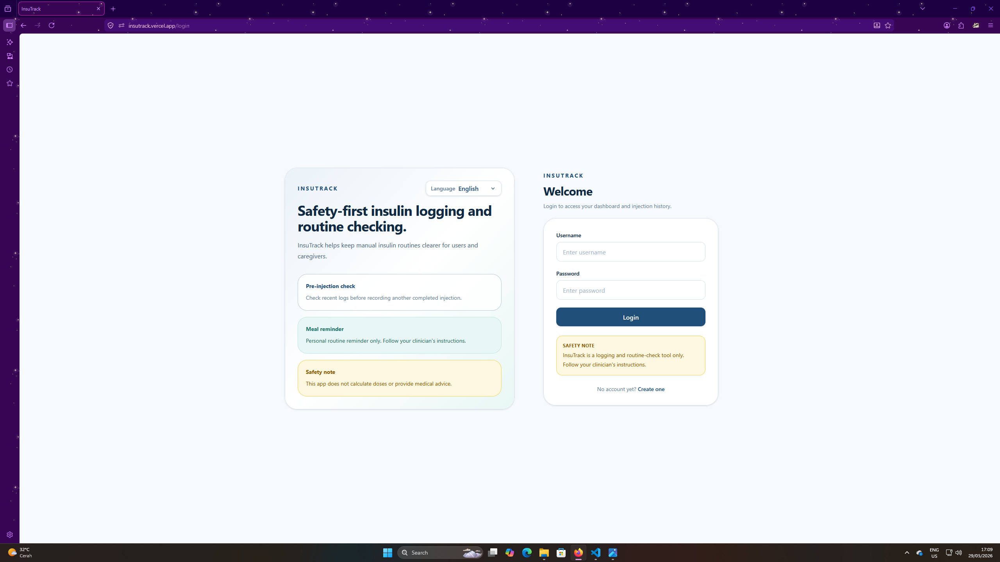
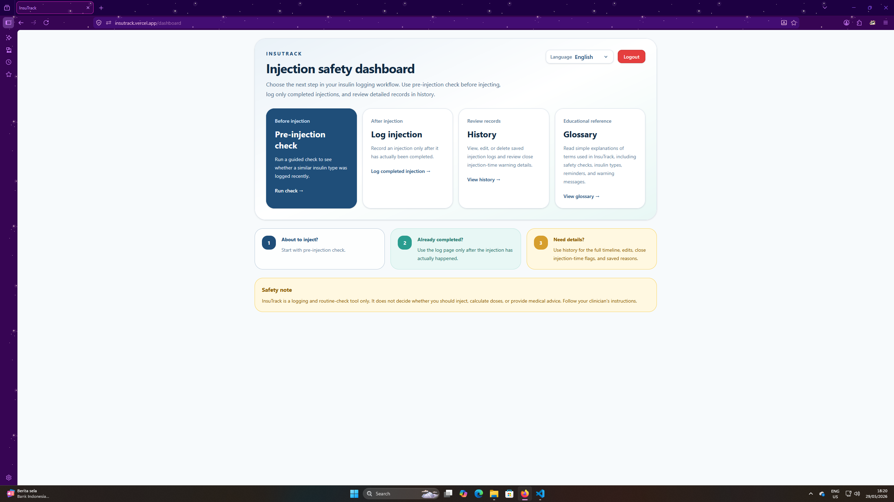
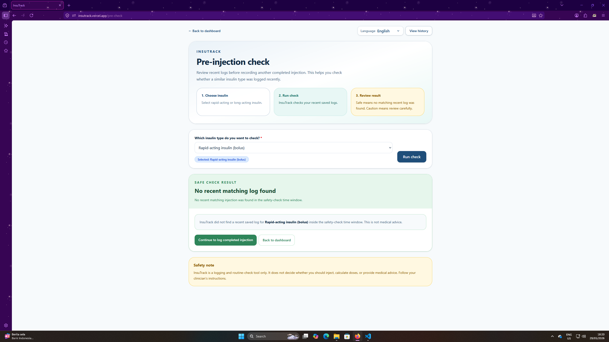
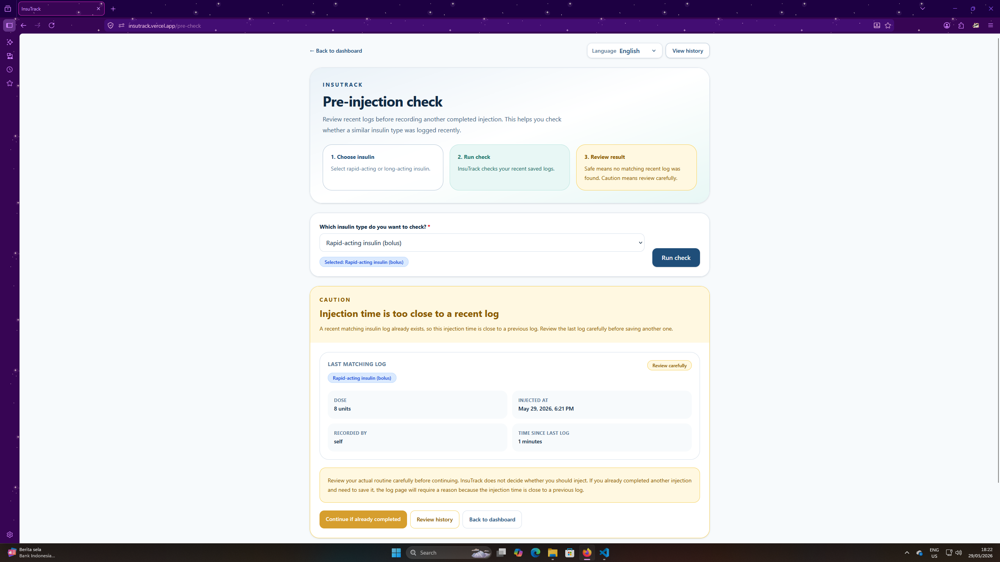
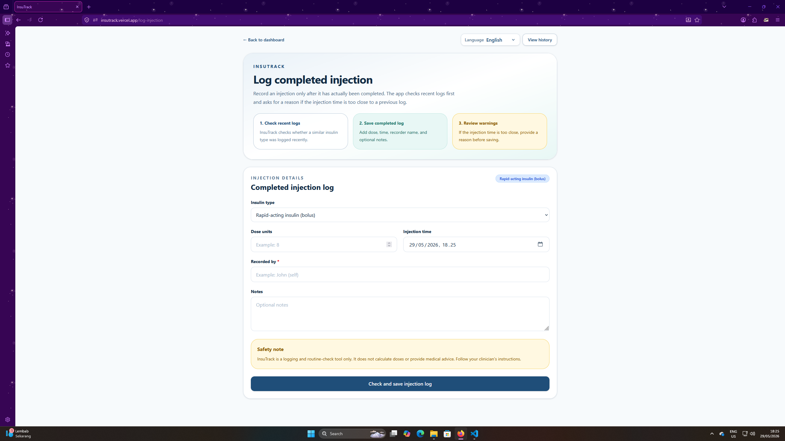
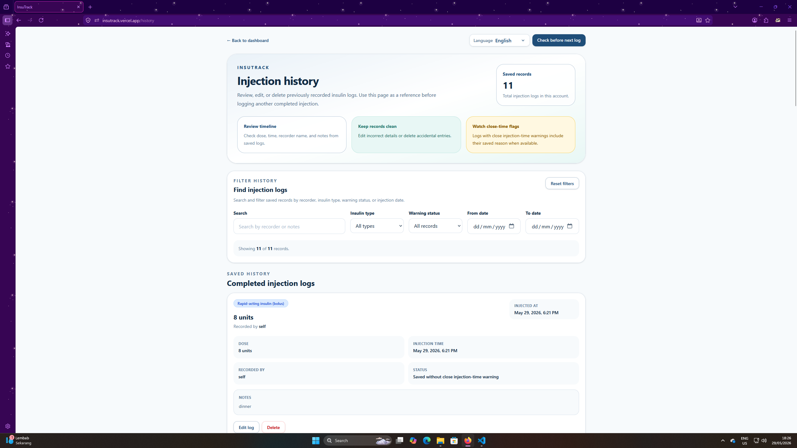
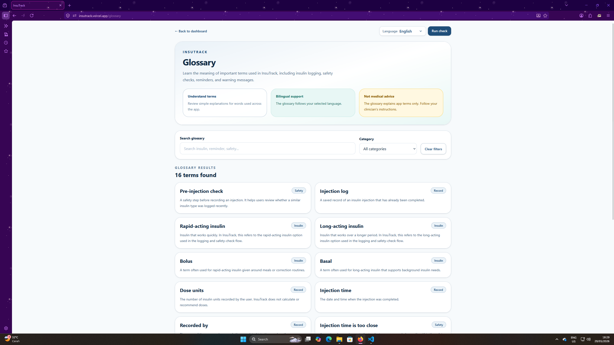

# InsuTrack

InsuTrack is a full-stack web application built with React and Django REST Framework. It helps users and caregivers record insulin injections, check recent injection history, and reduce the risk of accidental duplicate injection logging.

The app is designed as a logging and routine-check support tool only. It does not calculate insulin doses, give medical advice, or replace clinician instructions.

---

## Live Demo

Frontend:

```text
https://insutrack.vercel.app
```

Backend Health Check:

```text
https://insutrack-backend.onrender.com/api/health/
```

---

## Project Theme

Healthy Lives & Well-being

---

## Tech Stack

### Frontend

- React
- Vite
- React Router
- Axios
- Tailwind CSS

### Backend

- Python
- Django
- Django REST Framework
- Simple JWT Authentication
- SQLite for local development

### Deployment

- Frontend: Vercel
- Backend: Render

---

## Main Features

- User registration
- User login with JWT authentication
- Protected frontend routes
- Token refresh handling
- Dashboard page
- Injection log creation
- Injection history page
- History search and filters
- Edit injection logs
- Delete injection logs
- Pre-injection check
- Duplicate-risk detection
- Override reason for possible duplicate logs
- Meal reminder prompt after rapid-acting insulin log
- Browser notification reminder
- Glossary page
- Indonesian and English language support
- Responsive UI with Tailwind CSS

---

## Insulin Categories

The app uses generic insulin categories instead of brand names:

- Rapid-acting insulin (bolus)
- Long-acting insulin (basal)

In the app logic:

```text
RAPID_ACTING = Rapid-acting insulin
LONG_ACTING = Long-acting insulin
```

---

## Safety Disclaimer

InsuTrack is a logging and routine-check tool only.

It does not:

- calculate insulin doses
- recommend whether a user should inject
- provide medical advice
- guarantee prevention of all injection mistakes
- replace clinician instructions

Users should always follow their clinician’s instructions.

---

## Local Setup

### 1. Clone the Repository

```bash
git clone https://github.com/datuberu/insutrack.git
cd insutrack
```

---

## Backend Setup

Go to the backend folder:

```bash
cd backend
```

Install dependencies with Pipenv:

```bash
pipenv install
```

Activate the virtual environment:

```bash
pipenv shell
```

Run migrations:

```bash
python manage.py migrate
```

Start the backend server:

```bash
python manage.py runserver
```

The backend will run at:

```text
http://127.0.0.1:8000
```

API base URL:

```text
http://127.0.0.1:8000/api
```

If you do not use `pipenv shell`, you can run commands like this:

```bash
pipenv run python manage.py migrate
pipenv run python manage.py runserver
```

---

## Frontend Setup

Open a new terminal and go to the frontend folder:

```bash
cd frontend
```

Install dependencies:

```bash
npm install
```

Create a frontend environment file:

```bash
touch .env
```

Add this to `frontend/.env`:

```env
VITE_API_BASE_URL=http://127.0.0.1:8000/api
```

Start the frontend development server:

```bash
npm run dev
```

The frontend will run at:

```text
http://localhost:5173
```

---

## Environment Variables

### Frontend `.env`

```env
VITE_API_BASE_URL=http://127.0.0.1:8000/api
```

### Backend `.env` Example

```env
DJANGO_SECRET_KEY=replace-this-secret-key
DJANGO_DEBUG=True
DJANGO_ALLOWED_HOSTS=localhost,127.0.0.1
CORS_ALLOWED_ORIGINS=http://localhost:5173,http://127.0.0.1:5173
CSRF_TRUSTED_ORIGINS=http://localhost:5173,http://127.0.0.1:5173
```

For deployment, update the environment variables according to the deployed frontend and backend URLs.

---

## Running Tests

Go to the backend folder:

```bash
cd backend
```

Run the injection app tests:

```bash
pipenv run python manage.py test injections
```

The backend tests cover important safety logic, including:

- authentication requirement
- user data isolation
- safe pre-injection check
- caution pre-injection check
- invalid insulin type validation
- duplicate log rejection without override reason
- duplicate log saving with override reason
- meal reminder creation for rapid-acting insulin logs

---

## API Documentation

The backend API is built with Django REST Framework.

Local API base URL:

```text
http://127.0.0.1:8000/api
```

Production backend:

```text
https://insutrack-backend.onrender.com/api
```

Most endpoints require JWT authentication. After login, the frontend sends the access token using this header:

```http
Authorization: Bearer <access_token>
```

---

## Authentication Endpoints

| Method | Endpoint | Auth Required | Purpose |
| --- | --- | ---: | --- |
| POST | `/api/auth/register/` | No | Register a new user |
| POST | `/api/auth/login/` | No | Log in and receive JWT access and refresh tokens |
| POST | `/api/auth/refresh/` | No | Refresh expired access token |
| GET | `/api/auth/me/` | Yes | Get the current logged-in user |

### Register

```http
POST /api/auth/register/
```

Example request:

```json
{
  "username": "john",
  "email": "john@example.com",
  "password": "strongpassword123"
}
```

### Login

```http
POST /api/auth/login/
```

Example request:

```json
{
  "username": "john",
  "password": "strongpassword123"
}
```

Example response:

```json
{
  "refresh": "refresh_token_here",
  "access": "access_token_here"
}
```

---

## Injection Log Endpoints

| Method | Endpoint | Auth Required | Purpose |
| --- | --- | ---: | --- |
| GET | `/api/injections/` | Yes | Get all injection logs for the logged-in user |
| POST | `/api/injections/` | Yes | Create a new injection log |
| GET | `/api/injections/<id>/` | Yes | Get one injection log |
| PATCH | `/api/injections/<id>/` | Yes | Update one injection log |
| DELETE | `/api/injections/<id>/` | Yes | Delete one injection log |

### Create Injection Log

```http
POST /api/injections/
```

Example request:

```json
{
  "insulin_type": "RAPID_ACTING",
  "dose_units": 8,
  "injected_at": "2026-05-29T08:00:00+07:00",
  "recorded_by_name": "John",
  "notes": "Before breakfast",
  "override_reason": ""
}
```

Supported `insulin_type` values:

```text
RAPID_ACTING
LONG_ACTING
```

If the injection time is too close to a previous log with the same insulin type, the backend requires `override_reason`.

Example duplicate-risk request:

```json
{
  "insulin_type": "RAPID_ACTING",
  "dose_units": 8,
  "injected_at": "2026-05-29T08:30:00+07:00",
  "recorded_by_name": "John",
  "notes": "Separate completed injection",
  "override_reason": "I checked the previous log and this was a separate completed injection."
}
```

---

## Dashboard Endpoint

| Method | Endpoint | Auth Required | Purpose |
| --- | --- | ---: | --- |
| GET | `/api/dashboard/summary/` | Yes | Get dashboard summary data |

### Dashboard Summary

```http
GET /api/dashboard/summary/
```

Example response structure:

```json
{
  "last_rapid_acting": null,
  "last_long_acting": null,
  "recent_history": [],
  "upcoming_meal_reminder": null
}
```

This endpoint returns summary data for the logged-in user.

---

## Pre-Injection Check Endpoint

| Method | Endpoint | Auth Required | Purpose |
| --- | --- | ---: | --- |
| POST | `/api/precheck/` | Yes | Check whether a recent matching injection log exists |

### Run Pre-Injection Check

```http
POST /api/precheck/
```

Example request:

```json
{
  "insulin_type": "RAPID_ACTING"
}
```

Example safe response:

```json
{
  "status": "safe",
  "message": "No recent matching injection was found in the safety-check time window.",
  "last_injection": null,
  "time_since_last_minutes": null
}
```

Example caution response:

```json
{
  "status": "caution",
  "message": "The injection time is too close to a recent rapid-acting insulin (bolus) log. Please review before continuing.",
  "last_injection": {
    "id": 1,
    "insulin_type": "RAPID_ACTING",
    "dose_units": 8,
    "injected_at": "2026-05-29T08:00:00+07:00",
    "recorded_by_name": "John",
    "notes": "",
    "duplicate_risk_flag": false,
    "override_reason": ""
  },
  "time_since_last_minutes": 30
}
```

Duplicate-check windows:

```text
RAPID_ACTING: 4 hours
LONG_ACTING: 20 hours
```

---

## User Settings Endpoint

| Method | Endpoint | Auth Required | Purpose |
| --- | --- | ---: | --- |
| GET | `/api/settings/me/` | Yes | Get current user's settings |
| PATCH | `/api/settings/me/` | Yes | Update current user's settings |

### Update Meal Reminder Settings

```http
PATCH /api/settings/me/
```

Example request:

```json
{
  "meal_reminder_enabled": true,
  "meal_reminder_offset_minutes": 15
}
```

---

## Meal Reminder Endpoint

| Method | Endpoint | Auth Required | Purpose |
| --- | --- | ---: | --- |
| POST | `/api/meal-reminders/` | Yes | Create a meal reminder for a rapid-acting insulin log |

### Create Meal Reminder

```http
POST /api/meal-reminders/
```

Example request:

```json
{
  "injection_log": 1,
  "offset_minutes": 15
}
```

Example response:

```json
{
  "id": 1,
  "injection_log": 1,
  "remind_at": "2026-05-29T08:15:00+07:00",
  "offset_minutes": 15,
  "is_completed": false,
  "created_at": "2026-05-29T08:00:05+07:00"
}
```

Meal reminders are only created for `RAPID_ACTING` injection logs.

---

## Glossary Endpoint

| Method | Endpoint | Auth Required | Purpose |
| --- | --- | ---: | --- |
| GET | `/api/glossary/` | No | Get glossary terms used in the app |

### Get Glossary Terms

```http
GET /api/glossary/
```

Optional query parameters:

| Parameter | Example | Purpose |
| --- | --- | --- |
| `lang` | `en` or `id` | Choose glossary language |
| `category` | `insulin` | Filter by category |
| `q` | `dose` | Search glossary terms |

Example requests:

```http
GET /api/glossary/?lang=en
GET /api/glossary/?lang=id
GET /api/glossary/?lang=id&q=insulin
GET /api/glossary/?lang=en&category=safety
```

Example response structure:

```json
{
  "language": "en",
  "count": 3,
  "results": [
    {
      "key": "rapid_acting",
      "category": "insulin",
      "term": "Rapid-acting insulin",
      "definition": "Insulin that starts working quickly and is usually used around meals."
    }
  ],
  "disclaimer": "This glossary only helps users understand terms used in the app. InsuTrack does not calculate doses, decide whether users should inject, or provide medical advice."
}
```

---

## Safety Logic Summary

InsuTrack does not decide whether a user should inject insulin. It only checks the user's saved logs.

The duplicate-risk logic works like this:

1. User chooses an insulin type.
2. Backend checks recent logs with the same insulin type.
3. If a matching log exists inside the time window, the app returns a caution result.
4. If the user still saves the log, an override reason is required.

Duplicate-risk windows:

| Insulin Type | Window |
| --- | ---: |
| `RAPID_ACTING` | 4 hours |
| `LONG_ACTING` | 20 hours |

This logic is used only as a routine-check support feature, not as medical advice.

---

## Frontend Pages

| Page | Route | Purpose |
| --- | --- | --- |
| Login | `/login` | User login |
| Register | `/register` | User registration |
| Dashboard | `/dashboard` | Main navigation and reminder summary |
| Pre-injection Check | `/pre-check` | Check recent logs before continuing |
| Log Injection | `/log-injection` | Save completed injection logs |
| History | `/history` | View, search, filter, edit, and delete logs |
| Edit Injection | `/edit-injection/:id` | Edit an existing log |

---

## Screenshots

### Login Page



### Dashboard



### Pre-Injection Check



### Close-Time Warning



### Log Injection



### History with Filters



### Glossary



## Demo Flow

A typical demo flow:

1. Register a new account.
2. Log in.
3. Open the dashboard.
4. Run a pre-injection check.
5. Save a completed injection log.
6. Try saving another log close to the previous injection time.
7. Review the caution warning.
8. Enter an override reason if the second injection was actually completed.
9. Open the history page.
10. Search or filter saved records.
11. Open the glossary page to review app terms.

---

## Project Structure

```text
insutrack/
├── backend/
│   ├── accounts/
│   ├── config/
│   ├── injections/
│   └── manage.py
│
├── frontend/
│   ├── public/
│   ├── src/
│   │   ├── components/
│   │   ├── features/
│   │   ├── i18n/
│   │   ├── pages/
│   │   ├── routes/
│   │   ├── App.jsx
│   │   └── main.jsx
│   └── package.json
│
├── .gitignore
└── README.md
```

---

## Repository

```text
https://github.com/datuberu/insutrack
```

---

## Author

Datu Beru
